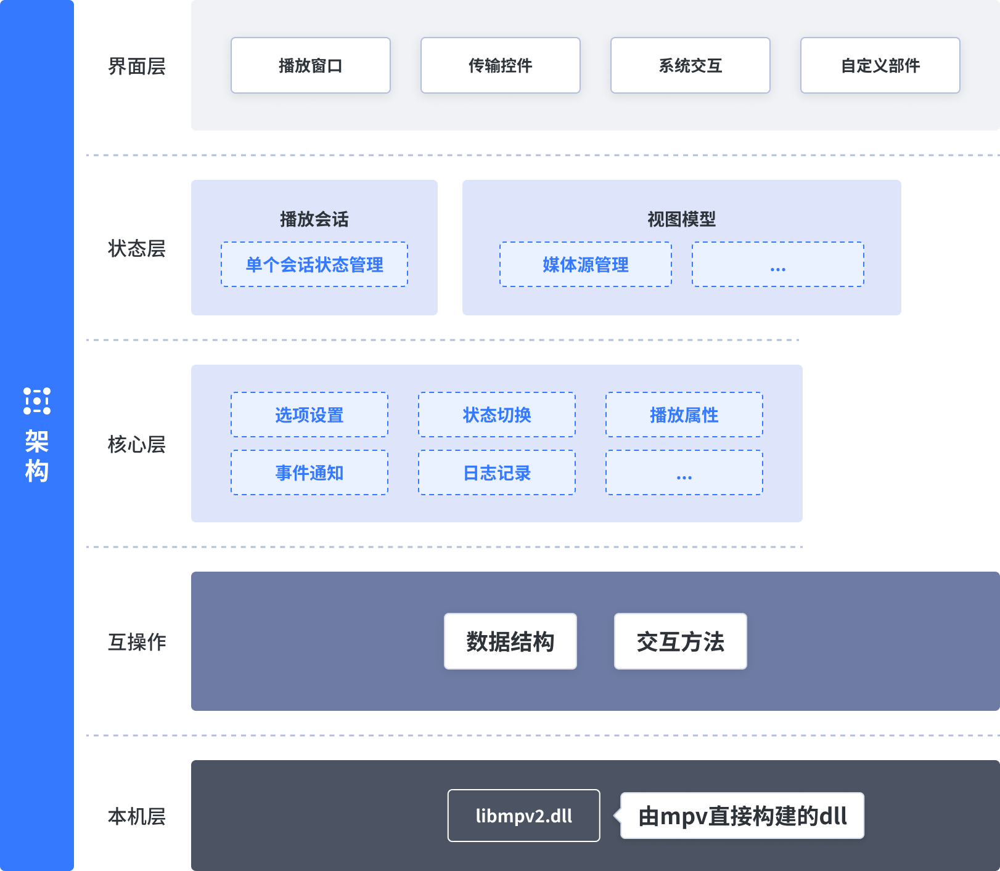

# 架构设计

## 本机层

从 [zhongfly/mpv-winbuild](https://github.com/zhongfly/mpv-winbuild) 获取构建的 libmpv2.dll

## 互操作

为方便 C# 调用，需将 mpv 暴露的 client.h 中公开的数据结构、方法转换成 C# 可用的互操作代码，基于 P/Invoke 实现。

## 核心层

核心对象为 `MpvClient`，建立在互操作层的基础上，可以视作对 [mpv.io](https://mpv.io/manual/stable/) 的无头实现。

它公开一系列现代化 API，并简化常用播放功能的调用。

初始化一个 MpvClient 视作创建一个播放器实例，其本身不存储任何状态。

在理想情况下，调用方不需要关心互操作层，只需要在初始化 MpvClient 时注入 libmpv2.dll 的路径。

但考虑到应尽可能将控制权限移交给开发者，`MpvClient` 仍会暴露 `MpvInteropHandle` 给调用方，调用方可以直接通过 `MpvNative` 访问底层API。

## 状态层

该层将是 UI 绑定的数据源，但本身在设计时不应与 WinUI 捆绑，它是平台无关的视图模型。

状态层应分成两个板块：

1. 播放会话（`PlaySession`）  
    播放会话会存储当前的播放状态，比如是否是暂停，是否正在加载，当前的音量、播放速度等。播放会话在设计时应专注于当前播放的内容，不必考虑如`播放下一个`等需求。
2. 外置视图模型  
    比如媒体源、字幕、播放列表等外部功能实现，在库中以接口形式对外公开。

上述板块将被封装成一个 `MpvPlayer` 类型，其本身不负责创建 MpvClient 实例，MpvClient 应由调用方创建并初始化，然后注入到 MpvPlayer 之中，以此来尽可能地解耦。

## UI 层

目前仅考虑 WinUI 平台的实现。

UI 主要分为四大块：

### 播放窗口

MPV 在 WinUI 平台上的嵌入播放效果一般（使用 SwapChainPanel），且只能用 OpenGL，无法完全发挥 mpv 的实力。

故比较好的方式是使用独立窗口播放，让 mpv 直接渲染在窗口内，然后使用 XamlIsland 承载 WinUI 组件，盖在播放内容上方。

所以需要有一个播放窗口对象，该对象负责管理 Win32 窗口（仅管理自身），提供基础的窗口操作API，比如关闭/最小化等。

同时在窗口内创建 XamlIsland，但本身不负责创建UI，UI将由外部注入。

### 媒体传输控件

它指代播放窗口内的 XamlIsland 承载的 Xaml 控件，主要是播放控制器。

### 系统交互

媒体播放时应该和系统组件进行交互（比如 SMTC），在播放时应该阻止系统自动锁屏等，这些操作尽量放在 UI 层完成。

### UI 插槽

为尽可能提供自定义能力，媒体传输控件在实现时可以预留一些 UI 插槽，以便调用方注入自定义 UI 组件。

